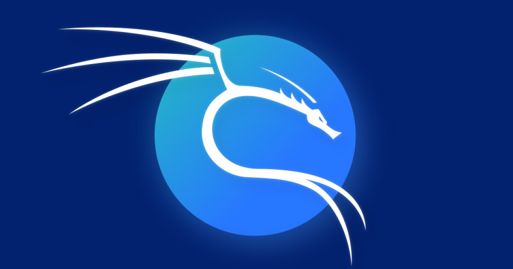

# Lucas Costa CV

  

# Lucas Costa

📞 +54 3534090459  
📧 lucascosta0912@gmail.com  
💼 Security Analyst  
💻 GitHub: [lucascosta0912](https://github.com/lucascosta0912)

---

## 🧾 Professional Summary

Experienced IT Operations Specialist with over four years in IT support, network administration, and cybersecurity. Strong background in data center maintenance, VMware server administration, and Microsoft Azure. Proficient in troubleshooting, IT infrastructure management, and implementing security best practices.

---

## 🛠 Skills & Expertise

- IT Support & Troubleshooting  
- Basic Network Administration (LAN/WAN, VLANs, QoS, STP)  
- Cybersecurity Fundamentals (Firewalls, Access Controls, Threat Monitoring)  
- VMware ESXi & vSphere Administration  
- Cloud Computing (Azure, DevOps, Microsoft 365)  
- Structured Cabling & Data Center Maintenance  
- Windows Server & Linux Administration  
- ITIL & Incident Management  

---

## 💼 Work Experience

### 🏢 Field Service Specialist — Nestlé  
📍 Villa Nueva, Córdoba, Argentina  
📅 Mar 2022 – Feb 2025  
- Supervised and maintained data center operations, ensuring optimal performance.  
- Designed and implemented network topologies (LAN/WAN).  
- Managed VMware environments (configuration, snapshots, firmware).  
- Provided on-site and remote IT support.  
- Configured switches (VLANs, QoS, LACP).  
- Implemented basic cybersecurity controls.

### 🏢 Senior Field Service Technician — Stefanini LATAM  
📍 Argentina  
📅 Mar 2022 – May 2024  
- Delivered enterprise-level IT support.  
- Reduced critical system downtimes.  
- Assisted in network upgrades and applied cybersecurity policies.

### 🏢 Sales & IT Support — Grupo Solvens (MercadoPago)  
📍 Buenos Aires, Argentina  
📅 Nov 2020 – Dec 2020  
- Provided tech/customer support for MercadoPago.  
- Guided clients through onboarding and troubleshooting.

### 🏢 IT Technician — Infoword  
📍 Bell Ville, Córdoba, Argentina  
📅 Jan 2014 – Dec 2015  
- Delivered hardware/software services for SMBs.  
- Performed diagnostics and optimization.

---

## 🎓 Education

- **Junior Cybersecurity Analyst** — Cisco Networking Academy *(2024)*  
- **Systems Engineering** — Universidad Tecnológica Nacional *(2020–2021)*  
- **Full-Stack Web Developer** — Udemy *(2020–2022)*  

---

## 📜 Certifications

- IT Platforms Data Center & Cloud – Remote Operations (LATAM)  
- iOS & Swift – The Complete iOS App Development Bootcamp  

---

## 🌐 Languages

- Spanish – Native  
- English – Professional Proficiency

